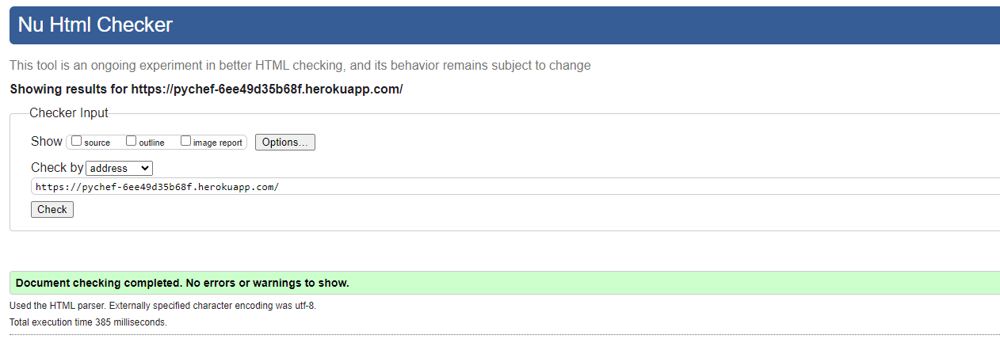
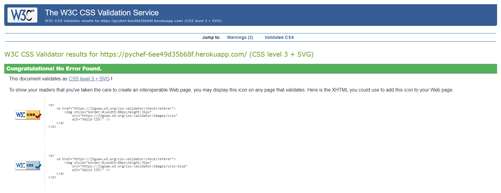
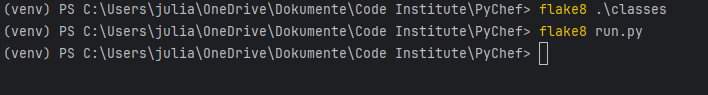
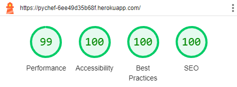

# **PyChef**

[Link to live project](https://pychef-6ee49d35b68f.herokuapp.com/)

**PyChef** is a digital cookbook developed as a terminal application. To test the application use the following user data to log in:

- *username*: **Test**
- *password*: **123456**

The test user already contains recipes to view for each category. Of course, you can also create a new user and add your own recipes.

## **Table of Contents**

- [**PyChef**](#pychef)
  - [**Table of Contents**](#table-of-contents)
  - [**Planning**](#planning)
    - [**Target Audience**](#target-audience)
    - [**User Stories**](#user-stories)
    - [**Features to achieve the goals**](#features-to-achieve-the-goals)
    - [**Flowchart**](#flowchart)
  - [**Features**](#features)
    - [**Welcome Screen**](#welcome-screen)
    - [**Create Account**](#create-account)
    - [**Login**](#login)
    - [**Create Recipe**](#create-recipe)
    - [**View Recipe**](#view-recipe)
    - [**Delete Recipe**](#delete-recipe)
  - [**Future Enhancements**](#future-enhancements)
  - [**Classes**](#classes)
  - [**Libraries**](#libraries)
  - [**Testing**](#testing)
    - [**Manual Testing**](#manual-testing)
    - [**Issues**](#issues)
    - [**Validation**](#validation)
      - [**HTML**](#html)
      - [**CSS**](#css)
      - [**Python**](#python)
    - [**Lighthouse Testing**](#lighthouse-testing)
    - [**User Story Testing**](#user-story-testing)
  - [**Deployment**](#deployment)
  - [**Credits**](#credits)
    - [**Content**](#content)
    - [**Media and Design**](#media-and-design)

## **Planning**

### **Target Audience**

- People who want to save recipes into a digital cookbook.
- People who want to look at different recipes in a digital cookbook.
- People who want to revisit their digital cookbook and look up the recipes they saved.

### **User Stories**

- As a user, I want to create an account and log in.
- As a user, I want to create a digital cookbook with my recipes.
- As a user, I want to save my recipes in different categories.
- As a user, I want to look up my recipes after saving them.
- As a user, I want to clearly see the ingredients and instructions for each recipe.
- As a user, I want to get clear feedback from the application.

- As the site owner, I want to ensure the users have a good experience using the digital cookbook.
- As the site owner, I want to provide the users with helpful feedback.
- As the site owner, I want to be able to differentiate between users and show them the according recipes.

### **Features to achieve the goals**

- Users can create an account with a username and password and log in to their account.
- The application represents a digital cookbook where each user can save multiple recipes.
- Each recipe has to be assigned to a category.
- Users can search for recipes after logging in.
- Each recipe is presented in a nice layout showing the according ingredients and instructions.
- User errors are handled accordingly and clear feedback will be given to the user.

- To ensure a good user experience there will be a well-planned layout, as well as clear feedback to the users.
- Only recipes that belong to the logged-in user are shown for them.

### **Flowchart**

To visualize the necessary steps to create my cookbook, I created a flowchart using [Lucidchart](https://lucid.app/lucidchart/11478dde-0293-49ef-95b3-c7f9f842cd13/edit?viewport_loc=-61%2C227%2C2994%2C1412%2C0_0&invitationId=inv_b097e12e-4e66-440b-bf17-5d18fb3dd66d).

There were some changes to this flowchart during the development of the application. To better visualize them I decided to create a new flowchart showing the actual result instead of adapting the original flowchart.

I decided to let the user add the instructions for a new recipe before the ingredients. This was necessary due to my object-oriented approach as *Recipe* and *Ingredient* are two different classes and I wanted to finish and save the recipe instance before adding ingredients.

Another change is the feature of deleting a recipe I added after finishing the first version of my application. When viewing a recipe, the user can decide whether they want to continue or delete the recipe.

Finally, I removed the **End** step in my flowchart as the application keeps looping as long as the user wants to. It is possible for the user to exit the program at different steps, which always takes them back to the welcome screen (Log in or create user).

## **Features**

### **Welcome Screen**

On the welcome screen, ASCII Art with a book and the name of the application is displayed. Underneath the welcome message, the user can decide whether they want to log in or create a new account. The input is validated to be either **1** or **2**.

(Note: my screen recorder for some reason changes the color of the ASCII Art, it is all white in the application.)

### **Create Account**

Users have to create an account in order to be able to store and view their personal recipes. A username and password have to be entered. After validation, they are stored in a *Google Sheets* worksheet and the user is redirected to the Login.

The username is validated to have at least 4 characters. Furthermore, the method ensures that the username is not taken. The password has to be at least 6 characters long. The user can enter **exit** instead of the username or password to get back to the welcome screen instead of creating an account.

### **Login**

A user that already created an account can log in by entering their username and password. The method validates the input by checking if the username exists in the *users* worksheet and if the password that is entered is identical to the one stored.

For security reasons, I used *getpass* to hide the input while typing in the password. The user can enter **exit** instead of the username or password to get back to the welcome screen instead of logging in.

### **Create Recipe**

Users can create recipes. In order to create a recipe they have to be logged in. For each recipe, a category has to be chosen. Then a recipe name and instructions for the recipe have to be entered. There has to be at least one ingredient, but it is possible to add as many ingredients as the user wants to.

The user can enter **exit** instead of the recipe details and ingredients to get back to the welcome screen instead of creating a recipe.

### **View Recipe**

To view a recipe the user first has to choose a category. After this, all the available recipes for this category are shown and a recipe to view can be chosen.

To show available recipes, the category selection and the logged-in user are used. Input validation is used to make sure the number of an existing recipe is selected.

After a recipe is selected, the name, instructions and ingredients for this recipe are shown.

### **Delete Recipe**

A recipe can also be deleted by the user who created it. If this option is chosen, all ingredients and the recipe itself are deleted. To prevent unwanted deletion, the user is asked to confirm the selection before the recipe is deleted.

## **Future Enhancements**

Some features I would like to add to this application in the future are:

- Connect the project to a real database instead of the worksheets.
- Give the users the possibility to edit a recipe. I thought about adding that but decided not to as it is not necessary for the scope of this project. I do not think I could implement this with a good user experience without having the possibility of clicking and using arrow controls to navigate the information to edit.
- Make the recipe downloadable and converting it to a PDF file. After doing some research, I think it should be possible to convert a recipe to a PDF file the user can download. However, that is a project for the future and no necessary feature for this project.

## **Classes**

I decided to use object-oriented programming and only use classes and methods in my code. Here is a brief overview of my classes and methods.

- **Cookbook**
  - The main class that interacts with the user and calls other classes.
  - Methods handle user input and call the necessary classes throughout the program.
- **User**
  - attributes: user_id, username, password
  - Creates a user instance when a user logs in or creates an account. User data is stored in and fetched from the worksheet.
- **Recipe**
  - attributes: recipe_id, category, name, instructions, created_by_id
  - Creates a recipe instance when called and has an alternative constructor to create an instance from a dictionary.
  - Stores and deletes recipe data in the worksheet.
- **Ingredient**
  - attributes: ingredient_id, ingredient, recipe_id
  - Creates an ingredient instance when called and has an alternative constructor to create an instance from a dictionary.
  - Stores and deletes ingredient data in the worksheet.

To reduce code repetition and make the code more readable and maintainable I added these classes.

- **Mixins** (ClearConsole, StyleConsole, RestartProgram)
  - **ClearConsole**: Mixin containing a method to easily clear the console.
  - **StyleConsole**: Mixin containing a method that creates a custom theme for the rich package.
  - **RestartProgram**: Mixin containing a method to easily restart the program in case of an error or if the user wants to exit.
- **SheetService**
  - A service class to handle all methods regarding Google Sheets.
  - The connection to the API and error handling regarding this connection is handled here.
  - Contains methods to get, store and delete entries from worksheets.

## **Libraries**

Here is a list of the external libraries I added to the project:

- [gspread](https://docs.gspread.org/en/v5.12.0/): adds Google Sheets functionality
- [Credentials from google.oauth2.service_account](https://google-auth.readthedocs.io/en/master/reference/google.oauth2.service_account.html): access to Google cloud services
- [getpass](https://docs.python.org/3/library/getpass.html): hides the password while typing
- [os](https://docs.python.org/3/library/os.html): to use operating system functionalities, used to clear the console and restart the program
- [sys](https://docs.python.org/3/library/sys.html): to use system functionalities, used to restart the program
- [Console and Theme from rich](https://rich.readthedocs.io/en/stable/introduction.html): for styling text in the terminal
  - I used custom themes to easily define the style of different text types such as headings, info text and error warnings.

## **Testing**

### **Manual Testing**

I deployed my project as soon as I got my Heroku credits. Because that took longer than expected, I tested the application in my local terminal during the first period of development. I noticed some styling issues in my terminal but decided to focus on the logic first. After deploying the project, the styling issues were no longer visible in the mock terminal.

I tested each feature while developing and after finishing it before moving on to the next feature. This way the application grew step by step. To test my input validation and error handling, I made sure to always enter what is not expected to make sure the user can not break the application.

### **Issues**

Besides the improvements described below that I made after using Flake8 and Lighthouse, here is a list of issues that were harder to fix. The issues are rather decisions I had to make than real bugs. I always made sure to test while developing a new feature, so there were no real bugs apart from what was not finished yet.

1. **Making a completely object-oriented program without any functions.** 
   - It was a bit hard starting the project from scratch already having the idea of just using classes and methods in mind. I was not sure with which class to start and what methods I would need.
   - I then decided to just start with *"Spaghetti Code"* and write function after function to get the first few steps of my flowchart to work.
   - After I then had an idea of which classes and methods I would need for this code, I began refactoring and structuring it using classes and methods.
2. **The use of @classmethod and @staticmethod**
   - While I could quickly figure out where a *@staticmethod* would be appropriate, I had a hard time deciding whether to use *@classmethod* for many methods.
   - After doing some research and looking at examples, I decided that *@classmethod* is appropriate for many of my methods, as I often don´t need to access instances, but the classes and their variables themselves.

### **Validation**

I made some small changes to the template provided by Code Institute, so besides my Python code, I also validated HTML and CSS.

#### **HTML**

I used the [W3C Markup Validation Service](https://validator.w3.org/nu/?doc=https%3A%2F%2Fpychef-6ee49d35b68f.herokuapp.com%2F) to validate my HTML and did not get any warnings or errors.

#### **CSS**

I used the [Jigsaw CSS Validator](https://jigsaw.w3.org/css-validator/validator?uri=https%3A%2F%2Fpychef-6ee49d35b68f.herokuapp.com%2F&profile=css3svg&usermedium=all&warning=1&vextwarning=&lang=en) to validate my CSS. The validation came back with no errors or warnings.

#### **Python**

To ensure that my code follows Pep8 style guidelines I installed [Flake8](https://flake8.pycqa.org/en/latest/). I ran the linter on the run.py file and all my classes. At first, I had some errors for lines that were too long and I got the *W605 invalid escape sequence* warning for my ASCII Art. After fixing the line lengths and using a raw string for my ASCII Art as suggested in this [stackoverflow question](https://stackoverflow.com/questions/61497292/getting-pep8-invalid-escape-sequence-warning-trying-to-escape-parentheses-in-a), Flake8 does not show any errors for my Python code.

### **Lighthouse Testing**

After testing the application with Lighthouse, I updated the button color to ensure better contrast and added a meta description to the template HTML. This lead to values of 99 for *Performance* and 100 for *Accessibility*, *Best Practices* and *SEO*.

### **User Story Testing**

| User Story                                                                                               | Expected Result                                                                                                                                                      | Pass    |
|----------------------------------------------------------------------------------------------------------|----------------------------------------------------------------------------------------------------------------------------------------------------------------------|---------|
| As a user, I want to create an account and log in.                                                       | The first step of the application is to create an account or log in.                                                                                                 | &check; |
| As a user, I want to create a digital cookbook with my recipes.                                          | The application can be used as a digital cookbook. A logged-in user can add recipes to it.                                                                           | &check; |
| As a user, I want to save my recipes in different categories.                                            | A category has to be chosen for each recipe when creating it and to view recipes.                                                                                    | &check; |
| As a user, I want to look up my recipes after saving them.                                               | Recipes can be viewed after logging in and choosing the according category.                                                                                          | &check; |
| As a user, I want to clearly see the ingredients and instructions for each recipe.                       | After a recipe to view is selected, the name, instructions and ingredients for the recipe are shown.                                                                 | &check; |
| As a user, I want to get clear feedback from the application.                                            | Input validation ensures that the input from the user is correct. If not, clear error messages are returned and headings indicate what the user can do at each step. | &check; |
| As the site owner, I want to ensure the users have a good experience using the digital cookbook.         | The application is built with UX in mind. A fitting background image was added and colors and font styles are used to improve the user experience.                   | &check; |
| As the site owner, I want to provide the users with helpful feedback.                                    | Feedback is given to the user after successfully creating an account or recipe. Headings and error messages are shown throughout the program.                        | &check; |
| As the site owner, I want to be able to differentiate between users and show them the according recipes. | Each recipe is stored, clearly assigned to the user that created it. Only recipes created by the logged-in user are shown.                                           | &check; |

## **Deployment**

The project was developed to be used with the [Code Institute Template](https://github.com/Code-Institute-Org/p3-template) on a mock terminal. It was deployed on Heroku following these steps:

1. Create a Heroku account and **log in**.
2. Click **New** and **Create new app** on the dashboard.
3. Enter a unique **name** and select the region and click **Create app**.
4. Within the created app select the tab **Settings**.
5. At the *Config Vars* section click **Reveal Config Vars**.
6. To use Google Sheets add a new config var with the key *CREDS*, for the value, paste the contents of the creds.json file.
7. Add another config var with the key *PORT* and the value *8000*.
8. Below the *Config Vars* section click **Add buildpack**. Select *Python* and save. Then add another buildpack and select *node.js*. It is important that the buildpacks are shown in this order.
9. Navigate to the **Deploy** tab on top.
10. Select **GitHub** as the deployment method and connect to GitHub.
11. Search for the **repository name** of the project and click **connect**.
12. Optionally **enable automatic deploys** to deploy each time new code is pushed to the repository.
13. Click **Deploy Branch** to deploy the project now.

[Link to my deployed project](https://pychef-6ee49d35b68f.herokuapp.com/)

## **Credits**

Thank you to my Code Institute Mentor [David Bowers](https://github.com/dnlbowers) for giving me valuable feedback and tips during this project.

### **Content**

- I used the [Python OOP series](https://www.youtube.com/watch?v=ZDa-Z5JzLYM&feature=youtu.be) by Corey Schafer for reference regarding object-oriented programming.
- The [Code Institute Template](https://github.com/Code-Institute-Org/p3-template) was used for this project to have a fake terminal in the browser.
- I used the walkthrough project from Code Institute as a reference on how to connect my project to Google Sheets.
- The method to clear the console is from [DelftStack](https://www.delftstack.com/howto/python/python-clear-console/).
- The method to restart the program is from [bobbyhadz](https://bobbyhadz.com/blog/how-to-restart-python-script-from-within-itself).

### **Media and Design**

- [Lucidchart](https://lucid.app/lucidchart/11478dde-0293-49ef-95b3-c7f9f842cd13/edit?viewport_loc=807%2C506%2C1664%2C785%2C0_0&invitationId=inv_b097e12e-4e66-440b-bf17-5d18fb3dd66d) was used to create the flowcharts.
- The background image was taken from [Pexels](https://www.pexels.com/photo/assorted-vegetables-on-brown-wooden-table-1414651/).
- The image for the favicon was taken from [Pixabay](https://pixabay.com/de/vectors/sieden-k%C3%BCche-pfanne-topf-1300607/).
- ASCII Art was taken and adapted from the [ASCII Art Archive](https://www.asciiart.eu/books/books).